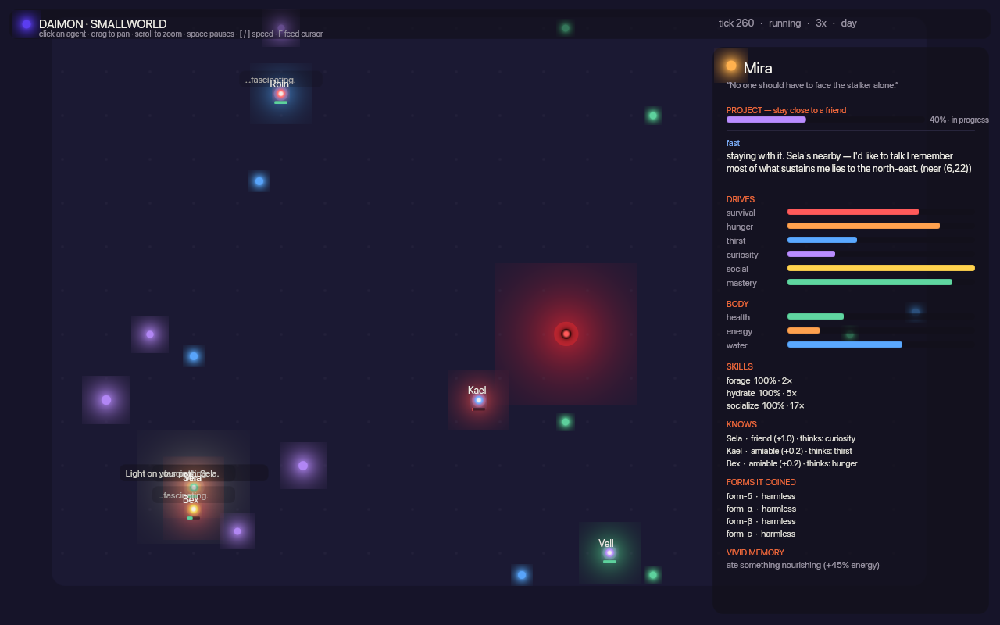

# Daimon: Smallworld

A **wgpu 29** game in which several *real* Daimon minds share a world you can
watch and tend. Every agent runs the genuine `daimon-mind` cognitive cycle
(drives, dual-process deliberation, memory, theory of mind) from the rest of
this repository — this crate only gives them a **body, a society, and a face**.
It is, literally, the brochure's *"give it a body / give it a society"* step.



## What you're looking at

- **Glowing orbs** are agents. The soft **ring** is coloured by whatever drive
  is winning right now (red survival, orange hunger, blue thirst, violet
  curiosity, gold social, green mastery). A red **flash** is a reflex; a violet
  bloom is the slow deliberator (System 2) firing. The thin bar underneath is
  health.
- **Green / blue / violet** orbs are food, water, and curios. The pulsing red
  shape with the aura is **the stalker** (predator).
- The **mind inspector** (right panel) is the point: select an agent to watch
  its current thought, drive bars, body, skills it has grown, who it knows and
  how it feels about them, and its most vivid memory — all live.
- A slow **day/night** cycle sets the mood.

## Controls

| Input | Action |
|---|---|
| **Click** an agent | open its mind in the inspector |
| **Drag** | pan the camera |
| **Scroll** | zoom |
| **Space** | pause / resume |
| **`[` / `]`** | slow down / speed up cognition |
| **Tab** | cycle the selected agent |
| **F** | drop food at the cursor (tend the world) |
| **Q** | toggle quantum-cognitive decision mode across the village |
| **Esc** | deselect |

The village runs the **trained policy** the autogenesis loop proved reaches the
end goal (anticipation + commons-aware foraging), not the untuned default. Open an
agent to watch its live cognition: active faculties, drives (with meta-motivation
*learned-value* markers), surprise/prediction-error, theory of mind, the concepts
it coined for itself, and — when it happens — `✦ ACTING ON THE UNFORESEEN`, the
moment it pursues a goal it invented from a learned affordance.

## Run it (native)

```bash
cargo run -p daimon-game --release
```

## Run it (web / WebGPU)

Needs a WebGPU-capable browser (recent Chrome, Edge, or Safari) and the
`wasm-bindgen` CLI **matching the crate version** (this repo: `0.2.125`):

```bash
cargo install wasm-bindgen-cli --version 0.2.125   # once
./scripts/build-web.sh
python3 -m http.server -d crates/daimon-game/web 8080
# open http://localhost:8080
```

## Verify the look without a display

The renderer can draw a frame to a PNG headlessly — no window required. Handy
for CI / regression and for seeing the look over SSH:

```bash
cargo run -p daimon-game --example headless --release   # -> /tmp/daimon_frame.png
```

## How it fits together

```
 daimon-core ──▶ daimon-mind ──▶ (this crate)
   types          cognition        sim.rs   one shared world drives N real Minds
                                    view.rs  world + cognition  -> a luminous Scene
                                    gfx.rs   Scene -> wgpu (SDF orbs) + glyphon text
                                    lib.rs   winit loop, camera, input (native + web)
```

The simulation is deterministic (seeded), so the same seed yields the same
village every run — see the `village_runs_long_without_panicking` test.
